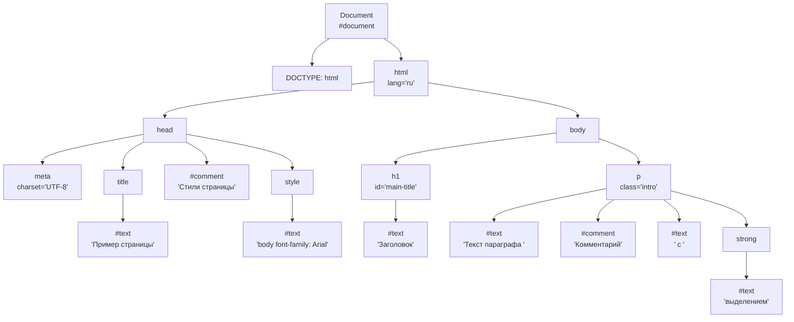

# 15. Объектная модель документа (DOM). Способы перемещения по элементам

> [◀️ К списку вопросов](../README.md#вопросы)

## Объектная модель документа (DOM)

DOM (Document Object Model) — это программный интерфейс, представляющий HTML-документ как древовидную структуру, где каждый элемент, атрибут и текстовый узел являются объектами. DOM позволяет программно взаимодействовать с содержимым страницы, изменять структуру, стили и содержимое с помощью JavaScript.

## Основные характеристики DOM

- **Дерево узлов:** Корневым узлом является объект `document`. Узлы включают элементы (теги), текстовые узлы, комментарии и атрибуты.
- **Типы узлов:**
  - Элемент (например, `<div>`, `<p>`).
  - Текстовый узел (содержимое текста внутри тега).
  - Атрибут (например, `id="value"`).
  - Комментарий (например, `<!-- текст -->`).
- **Свойства узлов:** Каждый узел имеет свойства, такие как `nodeType`, `nodeName`, `nodeValue`.

## Пример DOM-дерева HTML-документа

```html
<!DOCTYPE html>
<html lang="ru">
<head>
    <meta charset="UTF-8">
    <title>Пример страницы</title>
    <!-- Стили страницы -->
    <style>
        body { font-family: Arial; }
    </style>
</head>
<body>
    <h1 id="main-title">Заголовок</h1>
    <p class="intro">Текст параграфа <!-- Комментарий --> с <strong>выделением</strong>.</p>
</body>
</html>
```



## Способы перемещения по элементам DOM

1. **Перемещение через свойства узлов:**
   - **Синтаксис и описание:**
     - `parentNode`: возвращает родительский узел текущего элемента.
       - Пример: `element.parentNode` (например, для `<p>` внутри `<div>` вернет `<div>`).
     - `childNodes`: возвращает коллекцию всех дочерних узлов (включая текст и комментарии).
       - Пример: `element.childNodes` (NodeList, доступ через `element.childNodes[0]`).
     - `children`: возвращает коллекцию только дочерних элементов (игнорирует текст и комментарии).
       - Пример: `element.children` (HTMLCollection, доступ через `element.children[0]`).
     - `firstChild`: возвращает первый дочерний узел (может быть текстом).
       - Пример: `element.firstChild`.
     - `lastChild`: возвращает последний дочерний узел.
       - Пример: `element.lastChild`.
     - `firstElementChild`: возвращает первый дочерний элемент (игнорирует текст).
       - Пример: `element.firstElementChild`.
     - `lastElementChild`: возвращает последний дочерний элемент.
       - Пример: `element.lastElementChild`.
     - `nextSibling`: возвращает следующий узел на том же уровне (может быть текстом).
       - Пример: `element.nextSibling`.
     - `previousSibling`: возвращает предыдущий узел на том же уровне.
       - Пример: `element.previousSibling`.
     - `nextElementSibling`: возвращает следующий элемент на том же уровне (игнорирует текст).
       - Пример: `element.nextElementSibling`.
     - `previousElementSibling`: возвращает предыдущий элемент на том же уровне.
       - Пример: `element.previousElementSibling`.
   - **Пример:**

     ```javascript
     let div = document.querySelector('div');
     let firstChild = div.firstElementChild; // Первый дочерний элемент
     let parent = div.parentNode; // Родительский элемент
     let next = div.nextElementSibling; // Следующий элемент
     ```

2. **Перемещение с использованием методов выбора элементов:**
   - **Синтаксис и описание:** Методы, такие как `querySelector` и `querySelectorAll`, позволяют перемещаться к элементам по CSS-селекторам (подробно в вопросе 16). После выбора элемента можно использовать свойства выше для дальнейшего перемещения.
   - **Пример:**

     ```javascript
     let section = document.querySelector('section');
     let paragraphs = section.querySelectorAll('p'); // Все <p> внутри section
     ```

3. **Перемещение через атрибуты и вложенные элементы:**
   - **Синтаксис и описание:**
     - Доступ к элементам через атрибуты `id`, `class`, или другие с использованием методов (например, `getElementById`).
     - Перемещение к вложенным элементам через комбинацию свойств и методов.
   - **Пример:**

     ```javascript
     let container = document.getElementById('container');
     let firstChild = container.children[0]; // Первый дочерний элемент
     ```

## Пример перемещения (JavaScript)

```javascript
// Доступ к <h1>
let h1 = document.querySelector('#main-title');
// Родитель <h1> (<body>)
let parent = h1.parentNode; // <body>
// Первый дочерний элемент <body>
let first = parent.firstElementChild; // <h1>
// Следующий элемент после <h1>
let next = h1.nextElementSibling; // <p>
// Текстовый узел внутри <p>
let p = next;
let text = p.childNodes[0]; // "Текст параграфа "
```

## Синтаксические особенности

- **Пробелы и текстовые узлы:** Пробелы и переносы строк в HTML создают текстовые узлы (`nodeType: 3`). Например, между `<h1>` и `<p>` может быть текстовый узел с пробелом.

  ```javascript
  let body = document.querySelector('body');
  console.log(body.childNodes); // Включает текстовые узлы
  console.log(body.children); // Только элементы
  ```

- **Проверка типа узла:** Используйте `nodeType` для определения узла:

  ```javascript
  if (node.nodeType === 1) console.log('Элемент');
  if (node.nodeType === 3) console.log('Текст');
  if (node.nodeType === 8) console.log('Комментарий');
  ```

- **Динамичность:** `childNodes` и `children` возвращают коллекции (`NodeList` и `HTMLCollection`). `NodeList` (от `childNodes`) статичен, `HTMLCollection` (от `children`) обновляется при изменении DOM.

  ```javascript
  let nodes = document.querySelector('p').childNodes;
  nodes.forEach(node => console.log(node.nodeName));
  ```

- **Ошибки:** При отсутствии узла (например, `nextSibling` у последнего элемента) возвращается `null`. Проверяйте:

  ```javascript
  if (h1.nextSibling) console.log(h1.nextSibling);
  ```

## Особенности графа

- Все узлы связаны иерархически: корень (`document`) содержит `DOCTYPE` и `<html>`, `<html>` содержит `<head>` и `<body>` и т.д.
- Атрибуты (`lang`, `id`, `class`) не отображаются как отдельные узлы в дереве, но доступны через свойства элемента (например, `element.attributes`).
- Комментарии и текстовые узлы учитываются при навигации через `childNodes` или `nextSibling`, что требует осторожности при работе с DOM.

> [◀️ К списку вопросов](../README.md#вопросы)
